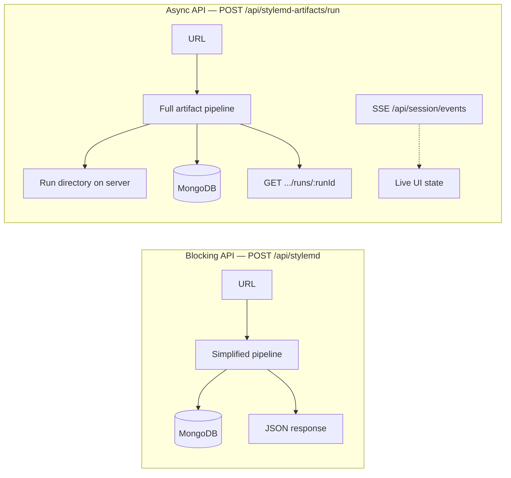

# StyleMD frontend integration guide

This document describes how a browser or SPA should integrate with the StyleMD backend: URL submission, scraping/generation pipelines, MongoDB persistence, live progress (SSE), and static artifacts.

**Default origin:** `http://localhost:3002` (override with `PORT`).

---

## 1. End-to-end flows (two pipelines)

The backend exposes **two different ways** to turn a page URL into StyleMD. Both use Playwright for capture/extract and LLM providers for curation/styleguide. Both **persist to MongoDB** after successful generation (`stylemd_runs` + `scraped_data.contentText`), provided `style.md` content is non-empty and Mongo is reachable.



| Aspect | **Simplified** (`POST /api/stylemd`) | **Artifact** (`POST /api/stylemd-artifacts/run`) |
|--------|--------------------------------------|--------------------------------------------------|
| HTTP | Single long request (minutes) | Immediate `{ runId }`; work continues in background |
| Progress | None over HTTP (no SSE from this route) | **SSE** recommended + poll summary |
| Stages | Shorter path (capture → extract → dedup → **synthetic curate** → styleguide) | Full stages: capture → extract → dedup → **LLM curate** → styleguide (+ optional showcase in other flows) |
| Artifacts | Disk under run id + DB | Rich artifacts on disk + DB |
| Concurrency | Multiple requests possible | **Only one active run** server-wide → `409` if busy |

---

## 2. Environment (backend)

| Variable | Purpose |
|----------|---------|
| `MONGO_URI` | **Required** at server startup. Without it the process exits. |
| `MONGO_DB_NAME` | Optional; default `stylemd`. |
| `PORT` | Optional; default `3002`. |
| `KIMI_API_KEY` | Required when `provider` is `"kimi"`. |
| `ANTHROPIC_API_KEY` | Required when `provider` is `"claude"`. |
| `CLAUDE_MODEL` / `ANTHROPIC_MODEL` | Optional model override for Claude. |

Dotenv is loaded from `backend/.env.local` or repo-root `.env.local`.

---

## 3. MongoDB collections (relevant to the UI)

| Collection | Written when | Main fields a frontend might surface |
|------------|--------------|--------------------------------------|
| **`stylemd_runs`** | After successful StyleMD generation (both pipelines) | `url` (unique), `slug`, `runId`, `styleMd`, `screenshot` (data URL), `screenshotUrl`, `provider`, `model`, `status`, `createdAt` |
| **`scraped_data`** | Same persist step (markdown mirrored as text) | `url` (unique), `contentText` (= StyleMD body), `createdAt`; optional SEO fields from the **scraped-data** API only |

**Important:** `POST /api/stylemd` **short-circuits on cache**: if a document with the same `url` already exists in `stylemd_runs`, the handler returns it immediately with `cached: true` and **does not** re-run the pipeline. To force a fresh run for that URL, clear cache (`DELETE /api/stylemd`) or delete/update the document out of band.

---

## 4. REST API reference

All JSON APIs use `Content-Type: application/json` unless noted. Errors generally look like `{ "ok": false, "error": "message" }`.

### 4.1 Health

**`GET /health`**

```json
{ "ok": true, "status": "running" }
```

---

### 4.2 Simplified pipeline (blocking)

**`POST /api/stylemd`**

Runs `runSimplifiedStyleMdPipeline`, then persists to Mongo.

**Body:**

```json
{
  "url": "https://example.com",
  "provider": "kimi"
}
```

- `provider`: `"kimi"` | `"claude"` — optional, default `"kimi"`.

**Success (fresh run):** `200`

```json
{
  "ok": true,
  "data": {
    "url": "https://example.com",
    "slug": "example",
    "runId": "stylemd_…",
    "provider": "kimi",
    "model": "kimi-k2.5",
    "styleMd": "# …",
    "screenshotUrl": "/styleguide-files/stylemd_…/full_screenshot.png",
    "screenshot": "data:image/png;base64,…",
    "status": "completed",
    "createdAt": "2026-05-03T12:00:00.000Z"
  }
}
```

**Cache hit:** same shape plus `"cached": true` — data comes from `stylemd_runs` only.

**Errors:** `400` validation / missing provider keys / pipeline error.

**Client notes:**

- Set long timeouts (5–15+ minutes) or use a server-side job proxy.
- Response can be large due to base64 screenshot.

---

**`DELETE /api/stylemd`**

Clears **all** documents in `stylemd_runs` (dangerous in production).

**Response:** `{ "ok": true, "message": "Cache cleared" }`

---

**`GET /api/stylemd/by-slug/:slug`**

Loads one run by **`slug`** or **`runId`** (`$or` query).

**Success:** `{ "ok": true, "data": { …same fields as POST data… } }`  
**`404`:** no matching document.

---

**`GET /api/stylemd/runs`**

Library list (metadata only, no full `styleMd`).

```json
{
  "ok": true,
  "summaries": [
    {
      "id": "stylemd_…",
      "url": "https://example.com",
      "slug": "example",
      "provider": "kimi",
      "model": "kimi-k2.5",
      "status": "completed",
      "createdAt": "…"
    }
  ]
}
```

---

### 4.3 Full artifact pipeline (async + SSE)

**`POST /api/stylemd-artifacts/run`**

Starts `runStyleMdArtifactsPipeline` in the background.

**Body:** same as simplified `{ "url", "provider"? }`.

**Success:** `200` `{ "ok": true, "runId": "stylemd_…" }`

**`409`:** another run is already active — `{ "ok": false, "error": "Run active: …" }`

**`400`:** validation / missing API keys.

---

**`POST /api/stylemd-artifacts/cancel`**

Aborts the active run (if any).

**Response:** `{ "ok": true, "canceled": boolean, "runId": string | null }`

---

**`GET /api/stylemd-artifacts/runs`**

Lists summaries by merging **disk** runs + in-memory summaries (used by control-room UI).

**Response:** `{ "ok": true, "summaries": [ StyleMdRunSummary, … ] }`

`StyleMdRunSummary` matches `lib/stylemd-artifacts/types.ts` (`runId`, `url`, `status`, `artifacts[]`, `metrics`, `showcase`, …).

---

**`GET /api/stylemd-artifacts/runs/:runId`**

Returns one summary or **404**.

**Response:** `{ "ok": true, "summary": { … } }`

Poll this after starting a run until `summary.status` is `completed`, `completed_with_warnings`, `failed`, or `canceled`.

---

### 4.4 Server-Sent Events (live progress)

**`GET /api/session/events`**

- **`Content-Type`:** `text/event-stream`
- Sends **`EventEnvelope`** JSON in SSE `data:` frames (see `lib/types/stylemdEvents.ts`).
- First message is usually **`state_sync`** with full UI state; then **`event`** payloads for each playground event (run started, stage started/completed, artifacts, run completed, etc.).
- Heartbeat: comment frames `: keepalive` every 15s.

**Browser example:**

```javascript
const es = new EventSource("/api/session/events");
es.onmessage = (e) => {
  const msg = JSON.parse(e.data);
  if (msg.type === "state_sync") {
    console.log(msg.payload.stylemd);
  } else if (msg.type === "event") {
    console.log(msg.payload.type, msg.payload);
  }
};
```

Use **relative URL** to the API origin, or pass absolute URL if the SPA is on another port (then ensure **CORS** — backend enables `cors()` for all origins).

---

### 4.5 Artifacts (preview API)

**`GET /api/stylemd-artifacts/artifact`**

Query params:

| Param | Required | Description |
|-------|----------|-------------|
| `runId` | yes | Run folder id |
| `path` | yes | Path **relative to the run directory** (e.g. `style.md`, `full_screenshot.png`, `summary.json`) |
| `mode` | optional | `preview` (default) or `raw` |

- **`mode=preview` + text** → `{ ok, previewType: "text", content, mimeType, truncated? }`
- **`mode=preview` + image** → `{ ok, previewType: "image", rawUrl, mimeType }` (prefer loading raw yourself with `path` relative)
- **`mode=raw`** → raw bytes with appropriate `Content-Type`

**Tip:** For images/HTML/static files you can also bypass the API and use:

**`GET /styleguide-files/:runId/...`** — static serve of the run directory (e.g. `/styleguide-files/{runId}/full_screenshot.png`).

---

### 4.6 Scraped data (separate from StyleMD pipeline)

These routes implement a **generic page scrape** into `scraped_data` (title, description, `rawHtml`, etc.). They are **not** the same code path as StyleMD generation, but they share the collection name for **markdown text** when the pipeline persists `contentText`.

**`POST /api/scraped-data`** — body `{ "url", "force"? }`  
**`GET /api/scraped-data`** — list up to 100 rows (excludes `rawHtml`).

---

### 4.7 Download showcase HTML

**`GET /api/stylemd/download-styleguide-v2?runId=…`**

Returns `styleguide/showcase.html` as a download (if present). **`404`** if file missing.

---

### 4.8 HTML pages (same origin)

| Route | Behavior |
|-------|----------|
| `GET /` | Redirect to `/stylemd` |
| `GET /stylemd` | Control room (EJS) |
| `GET /styleguide` | Redirect to latest showcase or 404 |
| `GET /styleguide/:runId` | Viewer page for showcase iframe |

---

## 5. Verification checklist (what “good” looks like)

1. **`GET /health`** returns `ok`.
2. **`POST /api/stylemd`** with a valid URL returns `data.styleMd` and after completion Mongo **`stylemd_runs`** has a row for that `url`.
3. **`GET /api/stylemd/runs`** lists the run (metadata).
4. **`GET /api/stylemd/by-slug/:slug`** returns the same logical record (slug or runId).
5. **Artifact path:** start **`POST /api/stylemd-artifacts/run`**, open **`EventSource`** on **`/api/session/events`**, poll **`GET /api/stylemd-artifacts/runs/:runId`** until terminal status; confirm **`stylemd_runs`** updated with same `runId`/`url`.
6. **Static asset:** `GET /styleguide-files/{runId}/full_screenshot.png` returns an image when the pipeline produced one.

---

## 6. Type references (TypeScript)

- Run summary / metrics: `lib/stylemd-artifacts/types.ts` — `StyleMdRunSummary`, `StyleMdArtifactRecord`, …
- SSE payloads: `lib/types/stylemdEvents.ts` — `EventEnvelope`, `PlaygroundEvent`

---

## 7. Common pitfalls

| Issue | Mitigation |
|-------|------------|
| Request timeout on `POST /api/stylemd` | Increase client/proxy timeout; or use artifact pipeline + polling |
| `409 Run active` | Wait for completion, call cancel, or use simplified endpoint |
| Cached result for URL | `DELETE /api/stylemd` clears **all** cached runs (dev only) or change URL query semantics |
| Mongo not saving | Server must start with `MONGO_URI`; persist step skips empty `styleMd` (logged server-side) |
| Large payloads | Prefer listing endpoints without full markdown; fetch full doc by slug when needed |

---

*Generated from the repository layout (`backend/src/routes`, controllers, `lib/stylemd-artifacts`, `lib/services/persistStyleMdMongo.ts`). Update this file when routes or persistence behavior change.*
