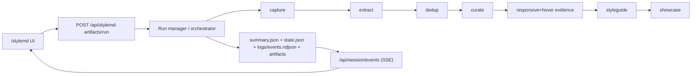

# Architecture

## Why This App Exists
StyleMD Lab turns a live website into two practical outputs:
- a reusable `style.md` reference (design system intent + tokens + patterns)
- a static showcase page that demonstrates those decisions

The pipeline is artifact-first: every stage writes files to disk so runs are inspectable, replayable, and debuggable.

## End-to-End Mental Model
Think of the system as a deterministic assembly line:
1. capture what the page looks like,
2. extract candidate components,
3. remove visual duplicates,
4. curate the study set,
5. synthesize `style.md`,
6. generate and validate showcase HTML.

## Orchestrator Behavior
`runStyleMdArtifactsPipeline` is the control plane for every run.
- It wraps each stage with common lifecycle handling: `started -> completed/failed`, duration tracking, event emission, and state persistence.
- It emits `stylemd_*` events consumed by `/api/session/events` so the UI timeline updates live.
- It persists both `state.json` (live state snapshot) and `summary.json` (final run summary).
- Styleguide failures are treated as recoverable warnings (`StyleguideStageError`), so showcase can still run and the run can end as `completed_with_warnings`.
- Provider and model are attached at run start and completion (`claude` or `kimi`).

## Stage-by-Stage Algorithm (Intuition + Mechanics)

### 1) Capture Stage
Goal: produce a stable full-page visual baseline.

Algorithm:
1. Wait for page settle (`domcontentloaded`, `load`, best-effort `networkidle`, font/image readiness).
2. Run overlay hygiene to hide popups/obstructions.
3. Capture full-page PNG with animations disabled.
4. Downsample screenshot before persistence.

Outputs:
- `full_screenshot.png`
- viewport + document height metadata

Cost/quality note:
- Screenshots are downsampled (`ratio=0.7`, capped by max dimensions) to reduce image payload/token cost while preserving legibility.

### 2) Extract Stage
Goal: convert the page into component-level evidence artifacts.

Algorithm:
1. Collect page style assets (including localized font artifacts/manifests).
2. Discover likely full-width section candidates using width and min-height thresholds.
3. For each candidate:
   - extract DOM/style evidence,
   - capture candidate screenshot (with sticky chrome suppression + downsampling),
   - write component files (`dom`, `styles`, `style_tree`, `pseudo`, `css_rule_refs`, `metadata`).
4. Emit raw component manifest for downstream stages.

Outputs:
- `components/candidates.json`
- `components/components_manifest.raw.json`
- `page_styles/*` including localized font metadata/CSS

### 3) Dedup Stage
Goal: remove visually redundant components before curation.

Algorithm:
1. Sort components top-to-bottom, then left-to-right.
2. Greedily maintain a canonical list.
3. Compare candidate vs canonical entries only when dimensions are compatible.
4. Compute SSIM on screenshots; if score >= threshold, mark as duplicate.
5. Delete duplicate component directories from disk.

Outputs:
- `components/components_manifest.deduped.json`
- `components/components_manifest.agent.json`
- `components/duplicates.json`

### 4) Curate Stage
Goal: pick the final study units that represent the page.

Algorithm:
1. Build compact prompt input from deduped artifacts.
2. Query provider (`claude` or `kimi`) in a read-only workspace for strict JSON decisions.
3. Validate JSON schema and component IDs.
4. If query/validation fails, use deterministic fallback decisions.
5. Apply decisions by keeping selected components and deleting the rest.

Outputs:
- `components/components_manifest.curated.json`
- `curation/decisions.parsed.json`
- `curation/decisions.applied.json`

### 5) Responsive/Hover Evidence (Pre-Styleguide Enrichment)
Goal: enrich curated units with responsive + interaction clues.

Algorithm:
1. Revisit curated units in browser.
2. Capture evidence across desktop/tablet/mobile breakpoints.
3. Attempt hover-state captures where applicable.
4. Persist evidence for styleguide/showcase reasoning.

Outputs:
- responsive/hover evidence artifacts under run directory

Failure behavior:
- Best-effort only; failures add warnings and pipeline continues.

### 6) Styleguide Stage
Goal: synthesize `style.md` from curated evidence.

Algorithm:
1. Build `styleguide/evidence.agent.json` (compact, agent-friendly evidence).
2. Build typography inventory and required family set.
3. Create a strict workspace containing only approved files.
4. Query provider for markdown draft (pass 1).
5. Run markdown quality checks; if needed, perform one escalation retry.
6. On success, write `style.md`; on failure, write validation artifacts and return warning.

Guardrails:
- Tool allowlist: `Read`, `Grep`, `Glob`, `LS`.
- Path guard: block out-of-workspace and raw-blocklisted paths.
- Oversized-read guard: reads > `20_000` bytes must use windowed `offset/limit`.
- Query timeout: `600_000ms` (10 minutes).

Outputs:
- `style.md`
- `styleguide/validation.json`
- `styleguide/evidence.agent.json`
- `styleguide/typography.inventory.json`

### 7) Showcase Stage
Goal: generate a static preview page consistent with `style.md` and localized assets.

Algorithm:
1. Validate prerequisites (`style.md`, evidence, required localized families).
2. Build showcase prompt input + isolated workspace.
3. Run iterative generation/repair passes (default budget 40; capped).
4. Per pass:
   - normalize model output to HTML,
   - inject local font CSS,
   - rewrite asset references to local artifact URLs,
   - run static checks + sandbox validation.
5. Stop on first valid HTML and persist `showcase.html`; else emit warning + diagnostics.

Outputs:
- `styleguide/showcase.html` (if valid)
- `styleguide/showcase.validation.json`
- `styleguide/showcase.response.raw.txt`

## Provider Model
Provider resolution is runtime-only and stage-agnostic:
- `claude`: Anthropic-compatible defaults from environment.
- `kimi`: Anthropic-compatible Moonshot endpoint/env with fixed model `kimi-k2.5`.

The same stage pipeline runs for both providers; only model + env override differ.

## What This Means for Collaborators
When you debug a run, inspect artifacts in stage order. Most issues become obvious by locating the first stage where expected artifacts or validation outputs diverge from normal.
